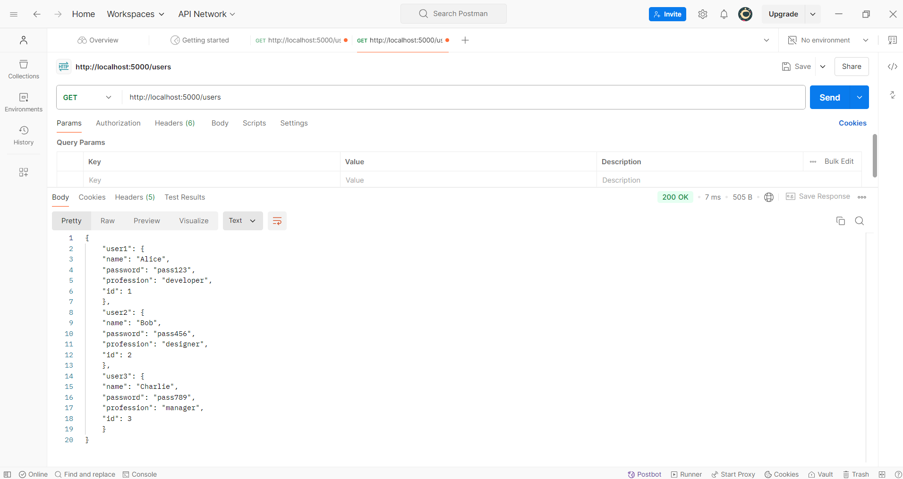
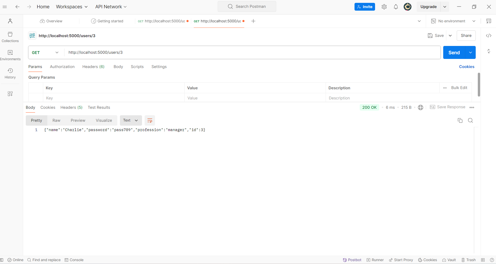
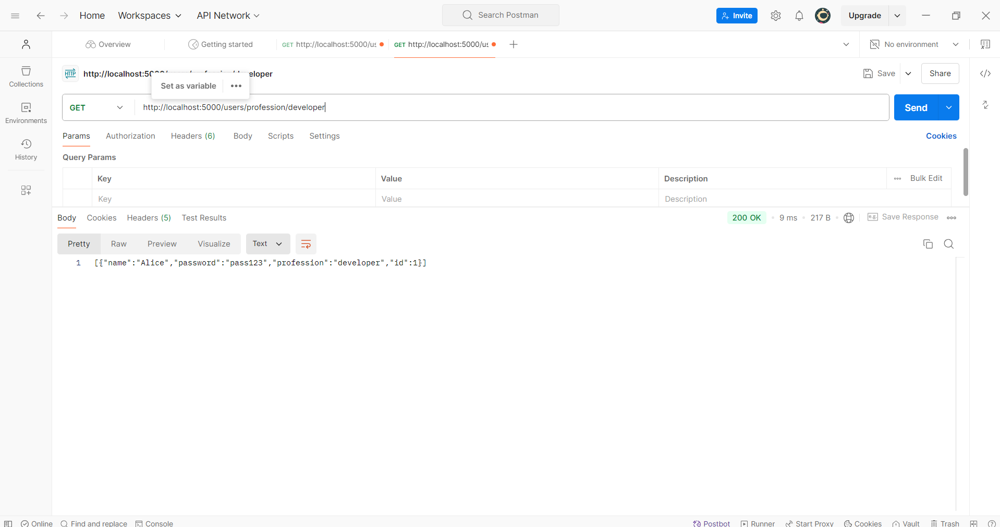
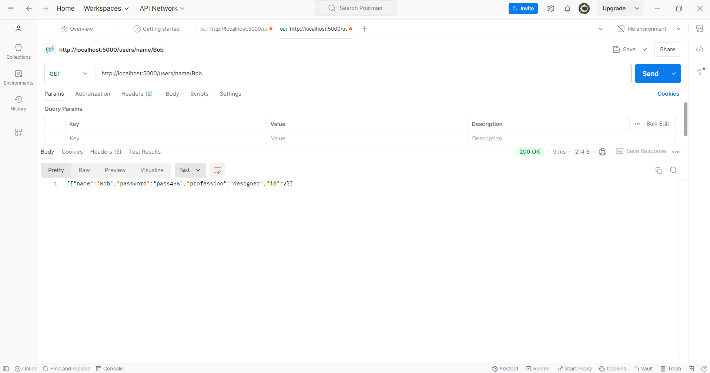

<!-- RESTful.API -->

User Management RESTful API
 Overview
This project is a RESTful API built with Node.js and Express. It allows users to:
 View all users.
 Find users by ID.
 Find users by profession.
 Find users by name.

Endpoints

1. Get All Users
   - Route: `/users`
   - **Screenshot:**  
     

2. **Get User by ID**
   - Route: `/users/:id`
   - **Screenshot:**  
     

3. **Get Users by Profession**
   - Route: `/users/profession/:profession`
   - **Screenshot:**  
     

4. **Get User by Name**
   - Route: `/users/name/:name`
   - **Screenshot:**  
     

What I Learned
Building a RESTful API with multiple endpoints.
Handling file operations using the `fs` module.
Testing APIs using Postman.
Implementing error handling for invalid inputs and ensuring the API works as expected.

Testing
The following screenshots demonstrate the successful execution of the API endpoints using Postman:

- Get All Users: Displays all users from the `/users` route.  
  

- Get User by ID: Shows the result of fetching a user by their ID using the `/users/:id` route.  
  

- Get Users by Profession: Filters users by profession using the `/users/profession/:profession` route.  
  

- Get User by Name: Fetches a user by their name with the `/users/name/:name` route.  
  

Discussion
This project helped me understand the basics of API development and testing. Testing with Postman was especially useful for debugging and verifying the API’s outputs. I also implemented error handling to ensure the API can respond appropriately when invalid inputs are provided, such as non-existent user IDs, professions, or names.

Error Handling Implementation
" If a user tries to access a non-existent user ID, profession, or name, a relevant error message is returned.
If the data file is missing or there is an issue reading the file, a server error message is shown."

---

<!-- By following these steps, I learned a lot about creating and testing APIs, as well as how to handle potential issues in real-world applications -->